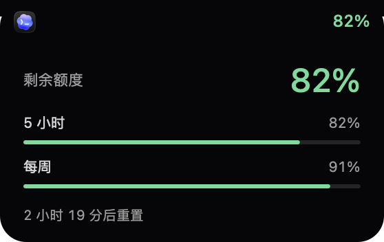
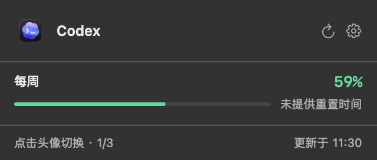
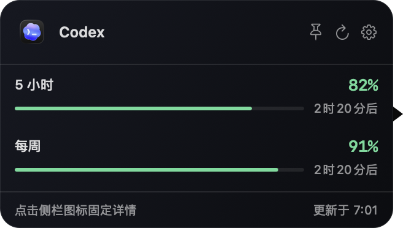
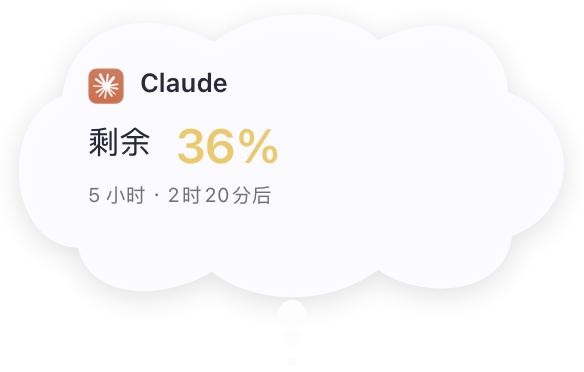

# AetherNotchQuota

[](https://github.com/bcblr1993/AetherNotchQuota/actions/workflows/ci.yml)
[](https://github.com/bcblr1993/AetherNotchQuota/releases/latest)

**AI 额度，一眼就知道。**

AetherNotchQuota 是 Apple Silicon Mac 上的原生 AI 订阅额度助手。把 **Codex、Claude、Antigravity** 的剩余额度和重置时间放在刘海、菜单栏或可拖动侧边栏，按自己的习惯选择账号、调整顺序、换上卡通伙伴。

[官网](https://aethernative.com/apps/notchquota/) · [下载正式版](https://github.com/bcblr1993/AetherNotchQuota/releases/latest) · [使用帮助](https://aethernative.com/apps/notchquota/support/) · [更新记录](CHANGELOG.md) · [反馈问题](https://github.com/bcblr1993/AetherNotchQuota/issues/new/choose)

## 选一种适合你的显示方式

| 模式 | 日常使用 |
| --- | --- |
| **灵动岛** | 刘海附近常驻图标和百分比，展开查看各周期额度；15 秒无操作收起详情。 |
| **菜单栏** | 点击打开紧凑的单账号面板，点击头像切换账号，可开启每分钟自动轮换。 |
| **侧边栏** | 同时查看已勾选账号，悬停查看详情、点击固定；拖到哪块显示器，就留在哪块。 |

<table>
<tr><th>灵动岛详情</th><th>菜单栏面板</th><th>侧边栏详情</th></tr>
<tr>
<td></td>
<td></td>
<td></td>
</tr>
</table>

## 让额度助手更像你的桌面伙伴

侧边栏收起后可选择 **小幽灵、奶油小兔、蜂蜜小熊、云朵团子、橘子小猫、枫糖小狐、糯米熊猫、冰蓝企鹅**。自由摆放时直立，靠近左右边缘时吸附并倾斜探出；鼠标移入立即展开账号面板。


- **思考泡泡**：空闲时每 10 分钟按顺序尝试提醒一个账号。提醒前先查询，失败、旧数据或未知额度跳过；成功后显示约 5 秒。
- **额度恢复提醒**：监测到 5 小时或每周额度恢复至 100% 时，随机播放一种短暂庆祝动画。
- **安静待机**：静置不播放循环动画；拖动、查看详情、临时隐藏和休眠时不弹出思考提醒。



## 多账号，自己决定怎么显示

支持 Antigravity 多实例，使用头像、账号身份和自定义别名区分。勾选需要显示的账号，拖动调整顺序；额外实例默认不启用，普通运行中未勾选的账号不查询额度。无法自动识别的受支持实例，可手动指定应用及登录文件。

只有一个账号时固定显示；灵动岛和菜单栏可按每分钟自动轮换，侧边栏固定排列已选账号。位置、显示器、外观和账号顺序会保存在本机。

还可以临时隐藏 **15 分钟、1 小时、3 小时或 5 小时**，需要时通过菜单栏的恢复入口立即显示。

## 三步开始使用

1. 在需要查询的 Codex、Claude 或 Antigravity 中登录订阅账号，并保持网络可用。
2. 下载正式版 DMG，将 **AetherNotchQuota** 拖入“应用程序”后启动；系统询问读取登录钥匙串时，按需允许。
3. 右键打开菜单，在“显示的应用”中勾选账号，在“设置与更新”中选择显示模式、卡通外观和开机启动。

支持 **Apple Silicon（M 系列）· macOS 13+**。原应用关闭后仍可使用有效登录查询额度，无需额外安装 Homebrew、Python 或 Node。

正式版经过 Developer ID 签名和 Apple 公证，使用 Sparkle 在应用内检查、下载、校验和安装更新。默认每天检查一次；检查更新不会自动下载或安装。

**旧版迁移**：NotchQuota 0.1.17 及更早版本需要手动安装新版；0.1.18 及以上版本可在应用内更新。账号与偏好沿用原有设置。

## 刷新与数据说明

- 正常运行每 **3 分钟**刷新已勾选账号；同一账号的常规请求至少间隔 30 秒，休眠时暂停新请求。
- 每分钟自动轮换读取缓存，悬停查看和固定详情也不会额外查询。
- 紧凑视图显示已知窗口中最少的剩余比例，展开后分别展示各周期、模型和服务返回的重置时间。
- **绿色 >50% · 黄色 20–50% · 红色 <20%**；未知额度用灰色表示。查询失败时保留并标注旧数据，不把失败当成 0% 或 100%。
- 各服务提供的周期和重置时间可能不同；未提供的字段会明确标注，不自行推算。

## 本机处理，清楚说明边界

应用没有额度服务器，不收集使用遥测，也不向开发者上传账号或额度。认证信息仅为查询额度，通过 HTTPS 发往对应服务；本地偏好保存账号选择、别名、显示设置及必要的身份核对信息。更新检查与头像下载等会产生普通网络请求，详见 [隐私说明](PRIVACY.md)。

目前适配订阅额度，不支持第三方 API 中转站余额。登录失效、网页验证、网络故障或上游接口变化可能导致暂时无法读取，请在原应用重新登录或通过 [问题模板](https://github.com/bcblr1993/AetherNotchQuota/issues/new/choose) 反馈。不要提交凭据、Cookie 或完整认证文件。

AetherNotchQuota 是独立开发的非官方工具，与 OpenAI、Anthropic、Google 无关联。第三方名称、标识和商标归各自权利人所有。

## 更多说明与开发

[完整使用与高级说明](docs/USAGE.md) · [架构](docs/ARCHITECTURE.md) · [发布维护](docs/RELEASING.md) · [性能验证](docs/PERFORMANCE.md)

原生 Swift / AppKit，除 Sparkle 更新组件外无第三方运行时依赖。源码以 Swift Package 管理，需要 macOS、Xcode 15+ / Swift 5.9+。

```sh
git clone https://github.com/bcblr1993/AetherNotchQuota.git
cd AetherNotchQuota
swift test
./scripts/build-app.sh
open build/AetherNotchQuota.app
```

本地开发构建不等同于已公证的正式版。项目原创代码采用 [MIT](LICENSE) 许可证；第三方素材见 [声明](THIRD_PARTY_NOTICES.md)。欢迎提交 Issue / PR。

图片为本次发布对应的原生界面渲染，额度、账号名称和时间均为演示数据。
